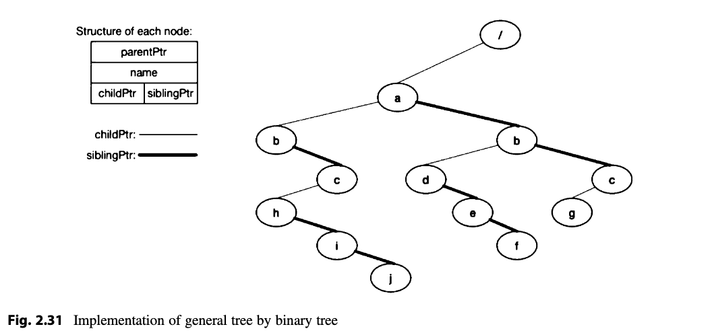

# Ext2 File System

# Table of Contents
- [Description](#description)
- [How to Set Up](#how-to-set-up)
- [Commands Implemented](#commands-implemented)
    - [Level 1](#level-1)
    - [Level 2](#level-2)
    - [Level 3](#level-3)


# Description

This project is intended to be a totally Linux-compatible ext2 file system.
The project deliverables were comprised of three primary sections. The first level
was expanding the base file system to implement the file system tree. Second level
focuses on implementing read and write operations of file contents. The third level
implements mount and unmount as well as focusing on security features of the
file system. The third level is partially complete and currently cannot unmount
a mounted image.


# How to Set Up

This project was implemented on an Amazon EC2 instance using x86
architecure, running:

```bash
PRETTY_NAME="Ubuntu 22.04.1 LTS"
NAME="Ubuntu"
VERSION_ID="22.04"
VERSION="22.04.1 LTS (Jammy Jellyfish)"
VERSION_CODENAME=jammy
```

To run you need these items:

- Linux distro on x86 architecture
- `apt-get install e2fslibs-dev`
- gcc (ran with gcc-11)

Scripts have been made to help gain an understanding of the project.

```bash
mkdir -p bin
mkdir -p images
./level3-example.sh
```

# Commands Implemented


## Level 1

Implements the file system tree. The structure is described on page 91
of the
[Systems Programming Book](./resources/Systems-Programming-Unix-Linux-2018-Asdisal.pdf)
. Also as a reference, the figure is below:




<table>
    <thead>
        <tr>
            <th>Command</th>
            <th>Implemented?</th>
            <th>Description</th>
        </tr>
    </thead>
    <tbody>
        <tr>
            <td>ls</td>
            <td>✅</td>
            <td>
                List information about the FILEs (the current directory by default).
            </td>
        </tr>
        <tr>
            <td>cd</td>
            <td>✅</td>
            <td>
                Changes the directory from the current working directory to the
                new path. Relative directory change if `/` is not specified.
            </td>
        </tr>
        <tr>
            <td>pwd</td>
            <td>✅</td>
            <td>
                Print the full filename of the current working directory.
            </td>
        </tr>
        <tr>
            <td>mkdir</td>
            <td>✅</td>
            <td>
                Create the DIRECTORY(ies), if they do not already exist.
            </td>
        </tr>
        <tr>
            <td>rmdir</td>
            <td>✅</td>
            <td>
                Remove the DIRECTORY(ies), if they are empty.
            </td>
        </tr>
        <tr>
            <td>creat</td>
            <td>✅</td>
            <td>
                Create the FILE(s), if they do not already exist.
            </td>
        </tr>
        <tr>
            <td>link</td>
            <td>✅</td>
            <td>
                Call the link function to create a link named FILE2
                to an existing FILE1.
            </td>
        </tr>
        <tr>
            <td>unlink</td>
            <td>✅</td>
            <td>
                Call the unlink function to remove the specified FILE.
            </td>
        </tr>
        <tr>
            <td>symlink</td>
            <td>✅</td>
            <td>
                Creates a symbolic link named linkpath which contains
                the string target.
            </td>
        </tr>
        <tr>
            <td>symlink</td>
            <td>✅</td>
            <td>
                Creates a symbolic link named linkpath which contains
                the string target.
            </td>
        </tr>
        <tr>
            <td>readlink</td>
            <td>✅</td>
            <td>
                Print value of a symbolic link or canonical file name.
            </td>
        </tr>
        <tr>
            <td>stat</td>
            <td>✅</td>
            <td>
                Print value of a symbolic link or canonical file name.
            </td>
        </tr>
        <tr>
            <td>chmod</td>
            <td>✅</td>
            <td>
                Change file mode bits
            </td>
        </tr>
    </tbody>
</table>


## Level 2

Focuses on read and write operations of files

<table>
    <thead>
        <tr>
            <th>Command</th>
            <th>Implemented?</th>
            <th>Description</th>
        </tr>
    </thead>
    <tbody>
        <tr>
            <th>utime</th>
            <th>✅</th>
            <th>
                Change file last access and modification times
            </th>
        </tr>
        <tr>
            <th>open</th>
            <th>✅</th>
            <th>
                Open and possibly create a file
            </th>
        </tr>
        <tr>
            <th>close</th>
            <th>✅</th>
            <th>
                Close a file descriptor
            </th>
        </tr>
        <tr>
            <th>lseek</th>
            <th>✅</th>
            <th>
                Repositions the file offset of the open file description
                associated with the file descriptor fd to the argument
                offset according to the directive
            </th>
        </tr>
    </tbody>
</table>

## Level 3

Focuses on mounting and unmounting disk images.

<table>
    <thead>
        <tr>
            <th>Command</th>
            <th>Implemented?</th>
            <th>Description</th>
        </tr>
    </thead>
    <tbody>
        <tr>
            <th>mount</th>
            <th>✅</th>
            <th>Mount a filesystem</th>
        </tr>
        <tr>
            <th>unmount</th>
            <th>❌</th>
            <th>Unmount a filesystem</th>
        </tr>
    </tbody>
</table>
